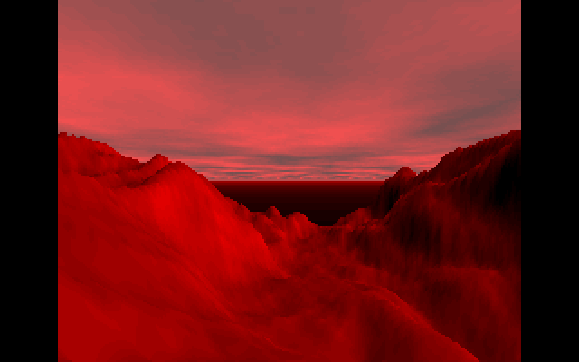

# MARS landscape

A comprehensive study of the outstanding code example from 1993 — the martian
landscape renderer by Tim J. Clarke.

Original code has been disassembled, rewritten and reduced from **5649** bytes
to about **1.5 kB**! :)

**Tim, if you read this, please contact me! I was trying to reach you, but I
couldn't...**



## ▶ Run it in your browser

**<https://matrix-toolbox.github.io/MARS.COM/>**

Click the canvas to capture the mouse — moving it pans the camera.

## Building and running it here

Alongside the annotated assembly, this repository can build the binary and
publish a browser-playable page:

- `scripts/build.sh` — assembles `MARS.ASM` into `MARS.COM`
- `scripts/build-site.sh` — composes the GitHub Pages site
- GitHub Actions workflows that verify the build and deploy the page

`MARS.ASM` remains the single source of truth; the binary is never committed.

## Building

```sh
make build     # assemble build/MARS.COM
make serve     # build the site and preview at http://localhost:8080
make test      # run the test suite
```

`MARS.ASM` is MASM/TASM dialect (`.model tiny`, `org 100h`, `COMMENT #`
blocks), so it needs a MASM-compatible assembler — NASM cannot build it. The
build uses [JWasm](https://github.com/Baron-von-Riedesel/JWasm), pinned in
`versions.env`. If no assembler is on your `PATH`, `build.sh` compiles JWasm
from source into `.toolchain/` automatically. With no C compiler available,
`bash scripts/build.sh --docker` runs the whole build in a container.

On macOS the JWasm build needs two portability fixes (its makefile targets
Linux/FreeBSD); `build.sh` applies them automatically.

Building the site also needs `mtools` (`brew install mtools` /
`apt-get install mtools`) to write `MARS.COM` into the floppy image.

### How the browser player works

The page boots a real emulated PC rather than emulating DOS. `make image`
takes the 720 KB FreeDOS boot floppy used by v86's own demos and injects
`MARS.COM`, the CuteMouse driver, and an `AUTOEXEC.BAT` that loads the driver
and runs the program. Both downloads are checksum-pinned in `versions.env`.

The mouse driver is not optional: MARS calls `int 33h`, which DOSBox-based
players implement internally but hardware emulation does not. Without a
resident driver the landscape still renders — MARS checks for the driver and
degrades gracefully — but the camera never moves.

### Build output

The pinned toolchain produces a **1550-byte** `MARS.COM`
(`sha256:10a1bb6c…`), byte-identical under JWasm v2.20 and v2.21 and across
macOS/clang/ARM64 and Linux/gcc. Upstream's README reports **1517** bytes; the
33-byte difference comes from the original author's toolchain and has not been
reconciled. `scripts/build.sh --check` enforces the 1550-byte result so
unintended changes to `MARS.ASM` are caught.

## Running it natively

It works on DOSBox and on genuine x86 machines (a mouse is needed). Under
DOSBox, always use `-machine vgaonly` — the renderer drives VGA mode 13h and
reprograms the palette DAC, and the default `svga_s3` emulation shows
artifacts. More details are on the
[author's page](https://chaos.if.uj.edu.pl/~wojtek/MARS.COM).

## Credits and licence

- Original martian landscape renderer — **Tim J. Clarke**, 1993
- Disassembly, rewrite and size reduction — **Wojciech Bruzda**, 2021
- Browser emulation — [v86](https://github.com/copy/v86) (BSD), booting
  [FreeDOS](https://www.freedos.org/) with the
  [CuteMouse](https://cutemouse.sourceforge.net/) driver (GPL)

Released under GPL-3.0, as upstream.
